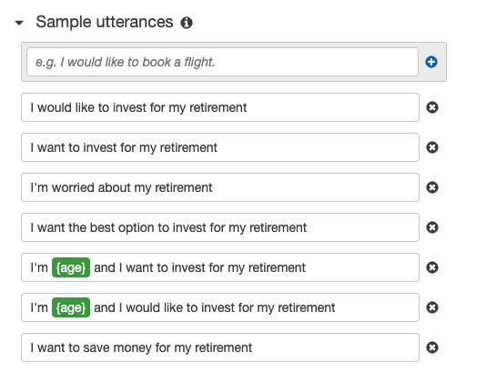
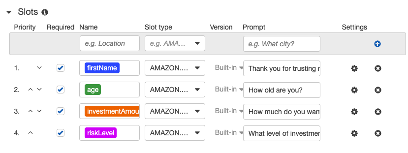
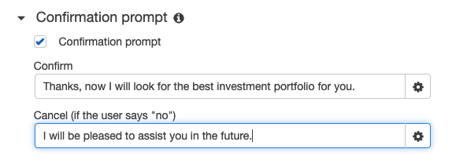

# Investment Robo Advisor
Most people are familiar with customer service phone wait times. You call customer service and receive this response: "The current wait time is 2 hours and 30 minutes". Customer service employees are busy and can only talk to so many people at once. This is where bots come in. Customers can chat with an online bot to receive the information they need instead of waiting on the phone to speak to a representative. Young people may also prefer this online chat experience to talking on the phone.

A retirement plan provider wants to increase their client portfolio, especially by engaging young people. To improve the customer experience and engage young people, the company decides to build a robo advisor. The robo advisor will provide investment portfolio recommendations for retirement. To create the bot, Amazon Web Services (AWS) and the Python language will be utilized. The user needs to be between ages 1-64, and the investment amount needs to be greater than or equal to $5000. 

---

## Technologies 
This project uses [Amazon Web Services](https://aws.amazon.com/) and the standard Python 3.7 libraries. Two Amazon Web Services were used to create the bot:
* [Amazon Lex](https://aws.amazon.com/lex/) - a fully managed artificial intelligence (AI) service with advanced natural language models to design, build, test, and deploy conversational interfaces in applications
* [Lambda](https://aws.amazon.com/lambda/) - a serverless, event-driven compute service that lets you run code for virtually any type of application or backend service without provisioning or managing servers

---

## Installation Guide and Usage
If you would like to create a bot similar to the one I've created for this repository, you need to sign up for an AWS account. Once you have an account, you can access the Amazon Lex and Lambda services.
* In Amazon Lex, add sample utterances, intent slots, and a confirmation prompt
* In Lambda, use the code found in the `lambda_function.py` file and the tests found in the "Test_Events" folder 
* In Amazon Lex, add the Lambda initialization and validation and add the "AWS Lambda function" under fulfillment. You no longer need the confirmation prompt, so you can uncheck that section
* Make sure to "Deploy" the code in Lambda and "Build" the bot in Lex before testing the bot

---

## Methods
1. **Configure the initial robo advisor using Amazon Lex**

Sample Utterances

Intent Slots

Confirmation Prompt 

2. **Build and test the robo advisor**

Initial Bot Test, Using Only Lex

3. **Enhance the robo advisor with an Amazon Lambda function**

See the code written in the `lambda_function.py` file, and the code for the tests in the "Test_Events" folder. All tests passed. See the bot examples below. 

---

## Bot Examples (with Lambda)
Here are some examples of the bot in action. The first gif shows a user who provides information within the parameters of age 1-64 and investment amount of at least $5000. The other gifs show examples of when a user does not provide information within the parameters and how the bot prompts the user to provide information within the parameters. 

Correct Information 

Incorrect Age Information 

Incorrect Investment Amount Information

Incorrect Age and Investment Amount Information 

---

## Contributors
Catherine Croft

Email: catherinecroft1014@gmail.com

LinkedIn: [catherine-croft](https://www.linkedin.com/in/catherine-croft-4715481aa/)

---

## License 
MIT